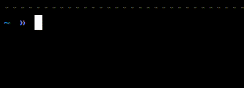

# CLI Timer
CLI tool that is very similar to `sleep` but it shows a timer with the remaining time (timer disappears when done).





It is safe to set
```bash
alias sleep=timer
```
As it behaves exactly the same as `sleep` (and more).

## Install

### Go install
You can install the package from code with [go](https://go.dev/doc/install) by running:
```bash
go install github.com/AmrSaber/timer@latest
```

To uninstall, run:
```bash
rm $(which timer)
```

### Download binary
You can also download and use your OS's related binary from [releases](https://github.com/AmrSaber/timer/releases).

## Usage
Use as:
```
timer 10s
```

You can add multiple durations (including negative ones) and they will all be summed together to get the final timer duration.

Durations can have any of go duration suffexis (h, m, s, ms, us, ...) but whatever duration is given it is rounded to the closest second. If no suffix is given to a duration, then `s` is assumed.

Not providing any duration, providing wrong duration, or cancelling the timer before it's done (sending SIGINT signal with ctrl+c) results in exit code of 1; otherwise, exits with 0 exit code when timer is done.

